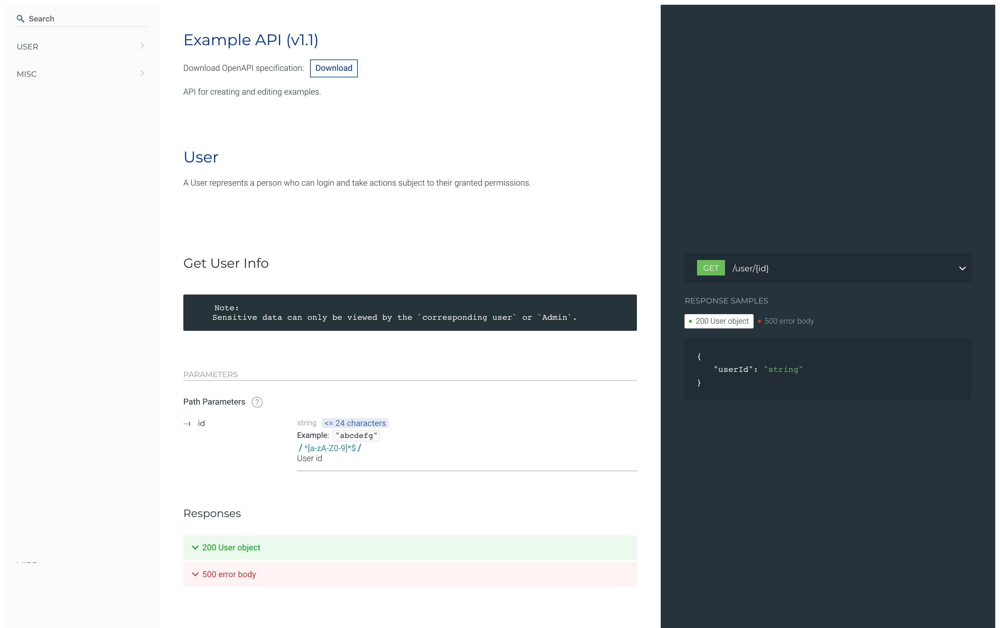

<div align="center">
  <a href="https://github.com/ziwon/koa-rest-api-docs" title="Koa REST API Boilerplate">
    
  </a>
  <br />
  <h1>Koa REST API Docs</h1>
</div>
<div>
 


</div>

<br />

**Koa REST API Docs** is a fork of [posquit0/koa-rest-api-boilerplate](https://github.com/posquit0/koa-rest-api-boilerplate) integrated with [koa-joi-router-docs](https://github.com/chuyik/koa-joi-router-docs) for generating Redoc API documentation and Swagger API console based on [joi-router](https://github.com/koajs/joi-router)

This boilerplate include the following features:

- Logging to STDOUT/STDERR stream using [Pino](http://getpino.io/)
- A super small and optimized [Docker](https://www.docker.com/) image based on [Node.js Alpine image](https://hub.docker.com/_/node/)
- Continuous integration and delivery using [CircleCI](https://circleci.com/)
- Unit Test and Integration Test along with Test Coverage using [Jest](https://facebook.github.io/jest/) testing framework
- Generating Redoc API documentation and Swagger API console

---


## Getting Started

```zsh
$ git clone https://github.com/ziwon/koa-rest-api-docs your-project-name
$ cd your-project-name
$ rm -rf .git && git init
```

```zsh
$ yarn
$ yarn start
```


## Commands

### Run

```zsh
# Run normally
$ yarn start
# Run the application with nodemon for development
$ yarn dev
```

### Test

```zsh
# Test
$ yarn test                           # Run all test
$ yarn test:unit                      # Run only unit test
$ yarn test:integration               # Run only integration test
# Test (Watch Mode for development)
$ yarn test:watch                     # Run all test with watch mode
$ yarn test:watch:unit                # Run only unit test with watch mode
$ yarn test:watch:integration         # Run only integration test with watch mode
# Test Coverage
$ yarn test:coverage                  # Calculate the coverage of all test
$ yarn test:coverage:unit             # Calculate the coverage of unit test
$ yarn test:coverage:integration      # Calculate the coverage of integration test
# Test consistent coding style (Lint)
$ yarn lint                           # Lint all sourcecode
$ yarn lint:app                       # Lint app sourcecode
$ yarn lint:test                      # Lint test sourcecode
```

### Archive

```zsh
$ yarn pack
```


## Test

All test for this boilerplate uses following tools.

- [Jest](https://github.com/facebook/jest)
- [supertest](https://github.com/visionmedia/supertest) - Easy HTTP assertions for integration test

## API docs

### Redoc

```
open http://localhost:7070/docs
```



### Swagger Console

```
open http://localhost:7070/console
```


## Contributing

Please contribute to this fork's awesome [original repository](https://github.com/posquit0/koa-rest-api-boilerplate).

## Todo

- Enable Redoc API console


## See Also

- [koa-logging](https://github.com/kasa-network/koa-logging) - A middleware that logs request and response with Pino.
- [koa-request-id](https://github.com/kasa-network/koa-request-id) - A middleware that generates a unique Request ID for every incoming HTTP request.
- [koa-http-client](https://github.com/kasa-network/koa-http-client) - A middleware that attachs HTTP client to communicate with the context during inter-service communications.


## License

Provided under the terms of the [MIT License](https://github.com/ziwon/koa-rest-api-docs/blob/master/LICENSE).

Copyright © 2017-2020, [Byungjin Park](http://www.ziwon.com), [Yeongpil Yoon](http://ziwon.github.com).
